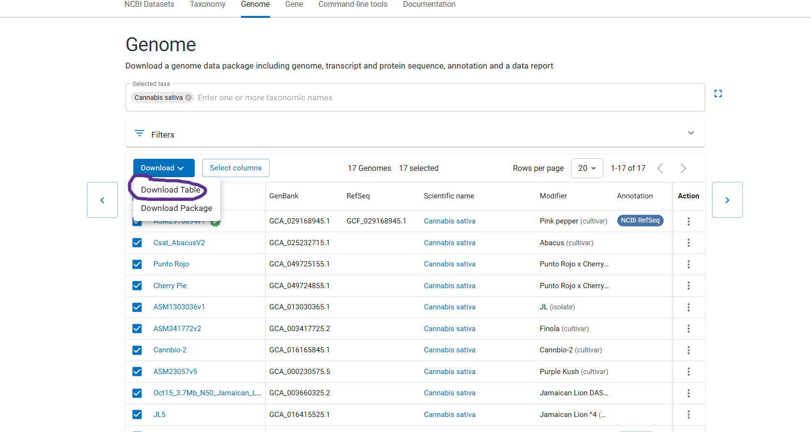

# Parallel NCBI Datasets Downloader

This README explains how to use the `download_ncbi.sh` script to fetch **genomes and annotations** from NCBI for a list of **GCA\_/GCF\_ accessions**. The script:

* Downloads the **NCBI `datasets`** CLI locally via `curl` (no root needed)
* Parses your **TSV** (uses **column 1**, skips a header that starts with `Assembly`)
* Validates accessions (`GCA_*/GCF_*` with version like `.1`)
* Uses **GNU Parallel** to download **genome, GFF3, protein, and CDS** for each accession
* Unzips results into one directory per accession and writes a manifest

---

## Requirements

* Linux shell with:

  * `curl`
  * `GNU parallel`
  * `unzip`
* Network access to NCBI (HTTPS). If your HPC requires a custom CA bundle, see **Troubleshooting → TLS/CA**.

> **Tip:** On many clusters you can install GNU Parallel via your module system or with `conda install -c conda-forge parallel`.

---

## Files provided / expected

* **Script:** `download_ncbi.sh`
* **Input TSV:** e.g. `assemblies.tsv` (tab-delimited)

  * Column 1 must contain accessions like `GCA_020379485.1`, `GCF_020379485.1`
  * The first line may be a header starting with `Assembly` — the script will skip it automatically

The list of genomes can be downloaded form NCBI directory, as in the image below from listed genomes, based on a species search:


### Example TSV (first few columns)

```
Assembly Accession	Assembly Name	Organism Name	...
GCA_020379485.1	Da-Ae	Brassica napus	...
GCF_020379485.1	Da-Ae	Brassica napus	...
GCA_033441925.1	ASM3344192v1	Brassica napus	...
```

---

## Quick start

```bash
# make the script executable
chmod +x download_ncbi.sh

# run: <tsv> [jobs]
./download_ncbi.sh assemblies.tsv 4
```

* `assemblies.tsv` — your metadata TSV
* `4` — number of parallel jobs (optional; default is 4)

On first run the script will download the `datasets` binary into the current directory as `./datasets` and mark it executable.

---

## What the script does

1. **Fetches NCBI `datasets` CLI** (linux-amd64) into `./datasets` if not present
2. **Parses** the first column of your TSV

   * Skips header if line 1 begins with `Assembly`
   * Trims whitespace and CRLF
   * Keeps only `GCA_`/`GCF_` accessions with a version suffix (e.g., `.1`)
   * Writes the unique list to `assemblies.txt`
3. **Connectivity check** using the first accession: `./datasets summary genome accession <ID>`
4. **Parallel downloads**

   * For each accession: `--include genome,gff3,protein,cds`
   * One ZIP per accession under `./zips/ACCESSION.zip`
5. **Parallel unzip**

   * Each ZIP is unpacked to `./out/ACCESSION/`
6. **Manifest**

   * `./logs/manifest.tsv` lists accession → ZIP path → output dir

**Directories created:**

* `zips/` — raw ZIP archives from NCBI `datasets`
* `out/`  — unzipped content: genome FASTA (`*.fna`), GFF3, proteins, CDS, `README.md`, `dataset_catalog.json`, etc.
* `logs/` — `parallel_jobs.tsv` + `manifest.tsv`

---

## Customizing what to download

By default the script downloads: **genome, GFF3, protein, and CDS**. To change it, edit the `INCLUDES` variable at the top of `download_ncbi.sh`, e.g.:

```bash
INCLUDES="genome,gff3"
```

Valid values include: `genome`, `gff3`, `cds`, `protein`.

---

## Good practices

* Start with **3–6 parallel jobs** to avoid NCBI rate limits. Increase slowly if stable.
* Keep your TSV **tab-delimited**. The script assumes `\t` between columns.
* Re-running is **idempotent**: existing ZIPs are skipped; unzips quietly overwrite.
* Track what you pulled using `logs/manifest.tsv`.

---

## Verifying inputs and outputs

**Preview the first few parsed accessions:**

```bash
head assemblies.txt
```

**Check one accession resolves at NCBI:**

```bash
./datasets summary genome accession GCF_000686985.2 | head
```

**List per-accession output:**

```bash
tree -L 2 out/GCF_000686985.2
```

---

## Troubleshooting

### 1) `Error: No assemblies found that match selection`

Common causes & fixes:

* **TLS/CA issue on HPC** — The container/host can’t validate NCBI’s HTTPS certificate.

  * Set a CA bundle and retry:

    ```bash
    export REQUESTS_CA_BUNDLE=/etc/pki/tls/certs/ca-bundle.crt   # RHEL/CentOS
    # or
    export REQUESTS_CA_BUNDLE=/etc/ssl/certs/ca-certificates.crt  # Debian/Ubuntu
    ./download_ncbi.sh assemblies.tsv 4
    ```
* **No outbound HTTPS** from your compute node — try from a login/DTN node if allowed, or ask your admins.
* **Malformed accessions** — ensure first column has values like `GCA_#########.##` or `GCF_#########.##` and that your file is truly TSV (tab-delimited). The script writes a cleaned list to `assemblies.txt`; inspect it.

### 2) Header or CRLF problems

* The script skips a first-line header starting with `Assembly` and strips CRLF, but if your TSV uses commas or spaces, convert it to a true TSV.
* You can normalize line endings with:

  ```bash
  sed -i 's/\r$//' assemblies.tsv
  ```

### 3) Rate limiting / throttling

* Reduce `jobs` (e.g., `./download_ncbi.sh assemblies.tsv 2`).
* Consider batching (edit the script to use `-N` with GNU Parallel) if needed.

### 4) Disk space

* Genomes + proteins + CDS can be large. Ensure you have enough quota. You can limit `INCLUDES` to just `genome,gff3`.

### 5) Resume after failure

* Re-run the same command. Existing ZIPs will be skipped and missing ones downloaded.

### 6) Alternate CA bundle location

* If your CA bundle is at a custom path, point `REQUESTS_CA_BUNDLE` to it before running the script.

---

## Example session

```bash
# 1) make the script executable
chmod +x download_ncbi.sh

# 2) run with 4 parallel jobs
./download_ncbi.sh assemblies.tsv 4

# 3) check results
wc -l assemblies.txt
ls zips | wc -l
head logs/manifest.tsv
```

---

## Output anatomy (per accession)

Inside `out/<ACCESSION>/ncbi_dataset/data/<ACCESSION>/` typically contains:

* `*.fna` — genomic FASTA (one or more)
* `*.gff` — GFF3 annotation
* `cds_from_genomic.fna` — CDS FASTA (if requested)
* `protein.faa` — protein FASTA (if requested)
* `README.md`, `dataset_catalog.json` — metadata

Paths may vary slightly depending on the assembly.

---

## Notes on GCA vs GCF

* **GCF\_**\* are **RefSeq** accessions; **GCA\_**\* are **GenBank**. Both work with `datasets`.
* Some assemblies may not have all artifact types (e.g., CDS/proteins). You’ll still get the available files.

---

## License / attribution

This script wraps the public NCBI **Datasets** service. Please respect NCBI usage guidelines and rate limits.

